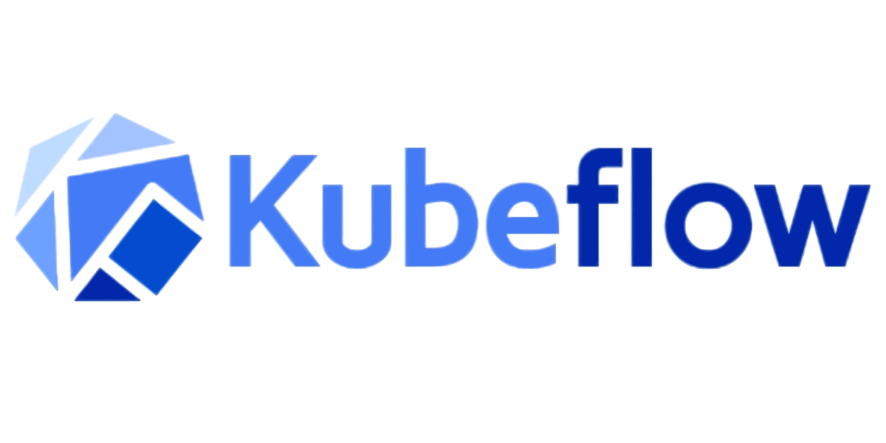

&nbsp; &nbsp; &nbsp; &nbsp;&nbsp; &nbsp; &nbsp; &nbsp; &nbsp; &nbsp; &nbsp; &nbsp; &nbsp; &nbsp;

**Release 0.1**
***Date 03/16/2022***

## About

This repo covers how to execute MLOps Pipelines with CI/CD. I have additionally added suplementary content
- BigQuery ML
- Vertex Training

## Pipelines

Before we get started it is a good to understand the concepts of Kubleflow. The [Kubeflow.md](Kubeflow.md) file covers the basics and understanding on Kubeflow. After finishing the Kubelflow.md, [Vertex Pipeline User Guide](docs/Vertex_Pipeline_User_Guide.pdf) provides a good introduction to Vertex AI Pipelines and how it is different from the Open Source Kubeflow pipelines.

## About

I this workshop you will do the following
* Setup your lab environment
* Setup Source Control with Cloud Source Repository
* Setup Build Trigger
* Run a basic intro to kubeflow lab
* Run a Kubelfow controls
* Build a sample Machine Learning Pipeline
* Trigger the machine learning pipeline using Cloud Functions
* Run CI/CD with MLOps Pipelines

## Qwiklabs Pipelines (Alternative to this workshop)
If you are interested in doing the Qwiklabs for Vertex Pipelines with Kubeflow, it has a good step by step process
[Qwiklabs Tutorials](https://www.cloudskillsboost.google/focuses/21234?parent=catalog)

### Enviroment

Setup the environment with following [pre steps](pre-steps.md)

 
### Code Organization
The code structure is defined in the following folders:

- **notebook**:
    This contains the notebooks for KFP and CI/CD.
    
    * **[01pipelines_intro_kfp.ipynb](notebooks/01pipelines_intro_kfp.ipynb)** 
                  This is an intro notebook to Pipelines
    * **[02control_flow_kfp.ipynb](notebooks/02control_flow_kfp.ipynb)** (Optional)
                  This a second KFP Pipelines showing how to work with control flows and parallel execution
    * **[03IrisflowersAutoMLKubeflowPipeline.ipynb](notebooks/03IrisflowersAutoMLKubeflowPipeline.ipynb)**:
                  This notebook shows the pipeline that can be executed cell by cell, to understand the pipeline flow.
    * **[04IrisPipelineTemplate.ipynb](notebooks/05IrisPipelineTemplate.ipynb)**: 
                  This notebook generates two pipeline files that can be used to by the build system
      
- **pipeline**:
    This folder containers the trainer code pipeline that is for model training
- **artifacts**:
    This is the docker file and other artifacts. This is optional and can be used if you want just have a training image that you would want to build out.

Following files in the root of the folder:
- **cloudbuild.yaml**:
     This is the build file used by cloud build. This has two steps one for build and one for execution of the pipeline.
- **requirements.txt**:
     Python packages needed to perform the build

### Steps to execute for this

Complete the [pre_steps](pre_steps.md) if you have not
* **Step1**
  Complete **[01pipelines_intro_kfp](01pipelines_intro_kfp.ipynb)**

* **Step2**
  Complete **[02control_flow_kfp.ipynb](notebooks/02control_flow_kfp.ipynb)** 
  
* **Step3**:
- Explore the pipeline code (IrisflowersAutoMLKubeflowPipeline.ipynb)
   We are going to work with the iris dataset to classiify flower images. This is fairly simple where you will use the dataset creation and AutoML to classify the images. At the end you will deploy the model.
   
* **Step4: Running Cloud Build Trigger and Pipeline**:
- Prepare the pipeline python code. Execute the notebook "IrisPipelineTemplate.ipynb". Change the needed variables in the code and generate the pipeline files. The pipeline files should be generated in the pipeline folder. There are two files. One is for the pipeline source and the other takes the compiled pipeline output and executes it.

* **Step5: Manual Build Execution**:
- Manually Execute the cloud build to test the pipeline
* `gcloud builds submit --config cloudbuild.yaml --timeout=1000`

* **Step6: Update the Pipeline**:

 - Change the pipeline parameters of the pipeline in the "IrisPipelineTemplate.ipynb" file. Execute the cells to generate the files.

* **Step7: Push the code to trugger cloud build and pipeline execution**:
  - Add files to the git repository 
    - `git add .`
    - `git commit -m "some message"`
    - `git push`
  
  Now open the cloud build console UI. You should see a build kicked off.
  You can navigate to Vertex AI Pipelines, you will see a pipeline launched.

* **Step8: Use Cloud Function and Cloud Scheduler**
    - Use [CloudFunctions  and Cloud Scheduler](https://cloud.google.com/vertex-ai/docs/pipelines/schedule-cloud-scheduler) to schedule a run.

## TFX
<html>
<iframe width="560" height="315" src="https://www.youtube.com/embed/YeuvR6m6ACQ" title="YouTube video player" frameborder="0" allow="accelerometer; autoplay; clipboard-write; encrypted-media; gyroscope; picture-in-picture" allowfullscreen></iframe>
</html>

