**Credits: This notebook section is work of [Juan Acevedo](https://github.com/entrpn/vertex-ai-samples/tree/main/labs/vertex-ai-pipelines/tfx).**. Thank you for your contributions.

# Intro to Vertex Pipelines with Tensorflow Extended

In this lab, you will learn how to create and run ML pipelines with
[VertexAI Pipelines](https://cloud.google.com/vertex-ai/docs/pipelines/introduction)
and [Tensorflow Extended](https://tensorflow.org/tfx)(TFX).

### What you learn

You'll learn how to:

\* Use the Tensorflow Extended SDK to build scalable ML pipelines

\* Create a pipeline that runs in your local environment. The pipeline reads an
image dataset, generates statistics, generates a schema, performs data
validation, does data transformations, trains a model, evaluates the model and
pushes it to a local directory.

\* Modify the local pipeline to use pre-built components for interacting with
Vertex AI services to transform, train and deploy the model in the cloud.

This lab assumes the reader is familiar with
[Apache Beam](https://beam.apache.org/) and
[Dataflow](https://cloud.google.com/dataflow)

## Intro to Vertex AI

Duration: 2:00

This lab uses the newest AI product offering available on Google Cloud.
[Vertex AI](https://cloud.google.com/ai-platform-unified/docs?utm_source=codelabs&utm_medium=et&utm_campaign=CDR_sar_aiml_vertexio_&utm_content=-)
integrates the ML offerings across Google Cloud into a seamless development
experience. Previously, models trained with AutoML and custom models were
accessible via separate services. The new offering combines both into a single
API, along with other new products. You can also migrate existing projects to
Vertex AI.

In addition to model training and deployment services, Vertex AI also includes a
variety of MLOps products, including Vertex Pipelines (the focus of this lab),
Model Monitoring, Feature Store, and more. You can see all Vertex AI product
offerings in the diagram below.

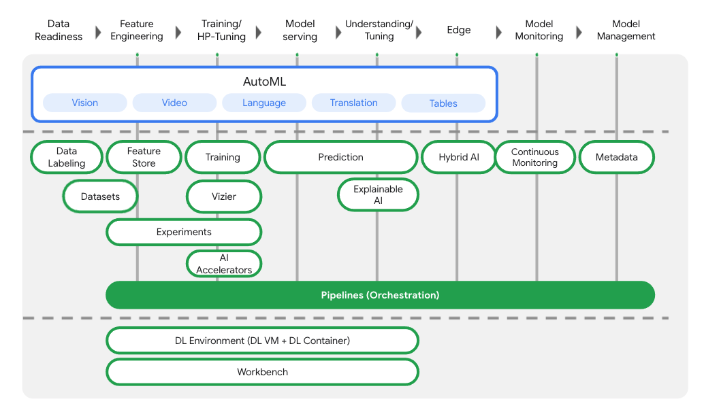

## Cloud environment setup

Duration: 10:00

You’ll need a Google Cloud Platform project with billing enabled to run this
codelab. To create a project, follow the
[instructions here](https://cloud.google.com/resource-manager/docs/creating-managing-projects?utm_source=codelabs&utm_medium=et&utm_campaign=CDR_sar_aiml_vertexio_&utm_content=-).

### Step 1: Start Cloud Shell

In this lab you're going to work in a
[Cloud Shell](https://cloud.google.com/cloud-shell/) session, which is a command
interpreter hosted by a virtual machine running in Google's cloud. You could
just as easily run this section locally on your own computer, but using Cloud
Shell gives everyone access to a reproducible experience in a consistent
environment. After the lab, you're welcome to retry this section on your own
computer.

> aside positive
>
> The first time you make a request in Cloud Shell requiring authorization, you
> will see an "Authorize Cloud Shell" dialog like the one shown below, to which
> you may safely click the "Authorize" button.

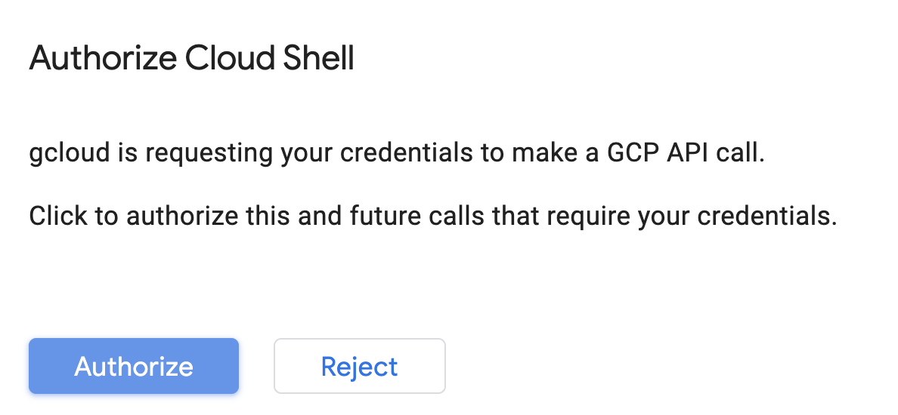

#### Activate Cloud Shell

From the top right of the Cloud Console, click the button below to **Activate
Cloud Shell**:


If you've never started Cloud Shell before, you're presented with an
intermediate screen (below the fold) describing what it is. If that's the case,
click **Continue** (and you won't ever see it again). Here's what that one-time
screen looks like:

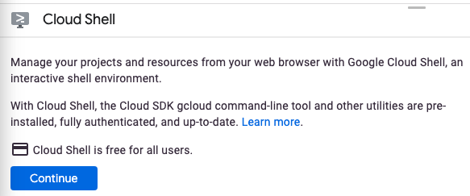

It should only take a few moments to provision and connect to Cloud Shell.

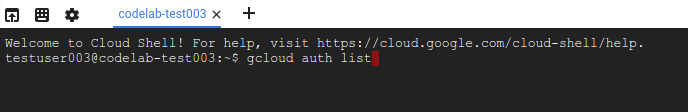

This virtual machine is loaded with all the development tools you need. It
offers a persistent 5GB home directory and runs in Google Cloud, greatly
enhancing network performance and authentication. Much, if not all, of your work
in this codelab can be done with simply a browser or your Chromebook.

Once connected to Cloud Shell, you should see that you are already authenticated
and that the project is already set to your project ID.

Run the following command in Cloud Shell to confirm that you are authenticated:

```
gcloud auth list
```

You should see something like this in the command output:

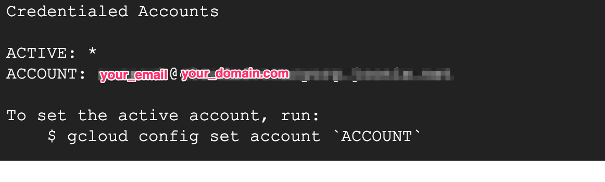

> aside positive
>
> **Note:** The `gcloud` command-line tool is the powerful and unified
> command-line tool in Google Cloud. It comes preinstalled in Cloud Shell. You
> will notice its support for tab completion. For more information, see
> [gcloud command-line tool overview](https://cloud.google.com/sdk/gcloud/).

Run the following command in Cloud Shell to confirm that the gcloud command
knows about your project:

```
gcloud config list project
```

**Command output**

```
[core]
project = <PROJECT_ID>
```

If it is not, you can set it with this command:

```
gcloud config set project <PROJECT_ID>
```

**Command output**

```
Updated property [core/project].
```

Cloud Shell has a few environment variables, including `GOOGLE_CLOUD_PROJECT`
which contains the name of our current Cloud project. We'll use this in various
places throughout this lab. You can see it by running:

```
echo $GOOGLE_CLOUD_PROJECT
```

### Step 2: Enable APIs

In later steps, you'll see where these services are needed (and why), but for
now, run this command to give your project access to the Compute Engine,
Container Registry, and Vertex AI services:

```
gcloud services enable compute.googleapis.com         \
                       containerregistry.googleapis.com  \
                       aiplatform.googleapis.com  \
                       cloudbuild.googleapis.com \
                       cloudfunctions.googleapis.com \
                       dataflow.googleapis.com
```

This should produce a successful message similar to this one:

```
Operation "operations/acf.cc11852d-40af-47ad-9d59-477a12847c9e" finished successfully.
```

### Step 3: Create a Cloud Storage Bucket

To run a training job on Vertex AI, we'll need a storage bucket to store our
saved model assets. The bucket needs to be regional. We're using `us-central`
here, but you are welcome to use another region (just replace it throughout this
lab). If you already have a bucket you can skip this step.

Run the following commands in your Cloud Shell terminal to create a bucket:

```
BUCKET_NAME=gs://$GOOGLE_CLOUD_PROJECT-bucket
gsutil mb -l us-central1 $BUCKET_NAME
```

Next we'll give our compute service account access to this bucket. This will
ensure that Vertex Pipelines has the necessary permissions to write files to
this bucket. Run the following command to add this permission:

Next we'll create a service account, give it access to this bucket and add the
necessary permissions needed to run Vertex AI pipelines.

```
gcloud projects describe $GOOGLE_CLOUD_PROJECT > project-info.txt
PROJECT_ID=$(cat project-info.txt | sed -nre 's:.*projectId\: (.*):\1:p')
gcloud iam service-accounts create vertexai-test \
    --description="My VertexAI account" \
    --display-name="vertexai-test"
SVC_ACCOUNT=vertexai-test@${PROJECT_ID}.iam.gserviceaccount.com
gcloud projects add-iam-policy-binding $GOOGLE_CLOUD_PROJECT --member serviceAccount:$SVC_ACCOUNT --role roles/storage.objectAdmin
gcloud projects add-iam-policy-binding $GOOGLE_CLOUD_PROJECT --member serviceAccount:$SVC_ACCOUNT --role roles/dataflow.admin
gcloud projects add-iam-policy-binding $GOOGLE_CLOUD_PROJECT --member serviceAccount:$SVC_ACCOUNT --role roles/dataflow.worker
gcloud projects add-iam-policy-binding $GOOGLE_CLOUD_PROJECT --member serviceAccount:$SVC_ACCOUNT --role  roles/aiplatform.user
gcloud projects add-iam-policy-binding $GOOGLE_CLOUD_PROJECT --member serviceAccount:$SVC_ACCOUNT --role  roles/iam.serviceAccountUser
```

### Step 4: Create a Vertex AI Workbench instance

From the
[Vertex AI section](https://console.cloud.google.com/ai/platform?utm_source=codelabs&utm_medium=et&utm_campaign=CDR_sar_aiml_vertexio_&utm_content=-)
of your Cloud Console, click on Workbench:

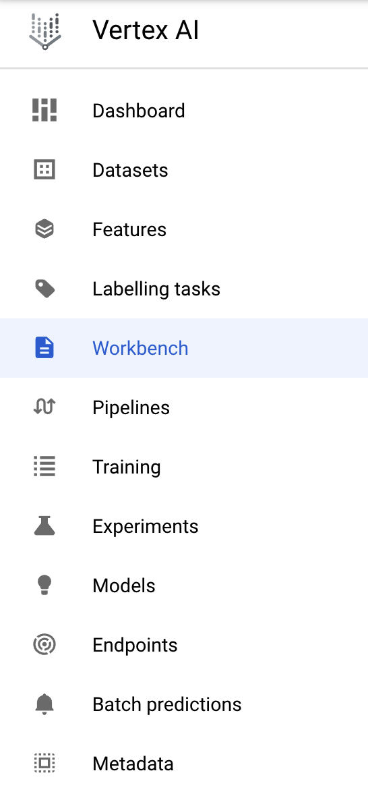

From there, within **user-managed Notebooks**, click **New Notebook**:


Then select the **TensorFlow Enterprise 2.3 (with LTS)** instance type **without
GPUs**:

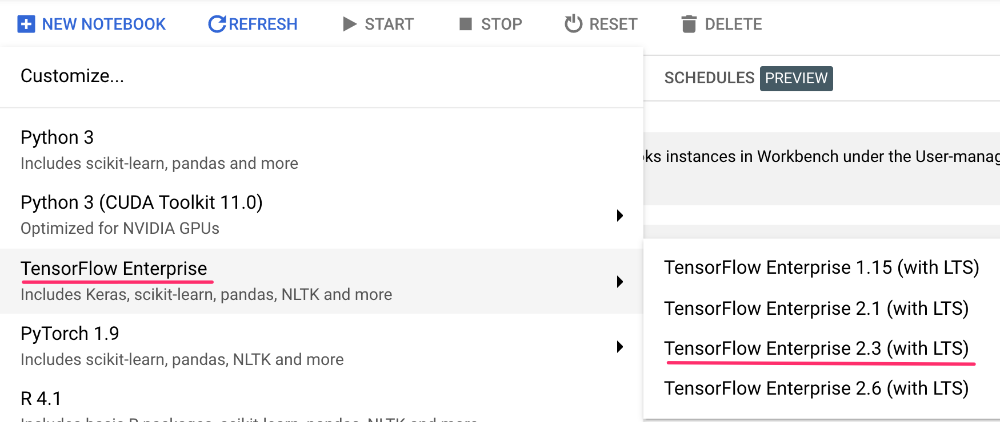

Use the default options and then click **Create**.

### Step 5: Open your Notebook

Once the instance has been created, select **Open JupyterLab**:


## Vertex Pipelines setup

Duration: 5:00

There is an additional library we'll need to install in order to use Vertex
Pipelines:

*   **Tensorflow Extended**: This is the SDK we'll be using to build our
    pipeline. Vertex Pipelines supports running pipelines built with both TFX or
    Kubeflow Pipelines.

### Step 1: Create Python notebook and install libraries

First, from the Launcher menu in your Notebook instance, create a notebook by
selecting **Python 3**:

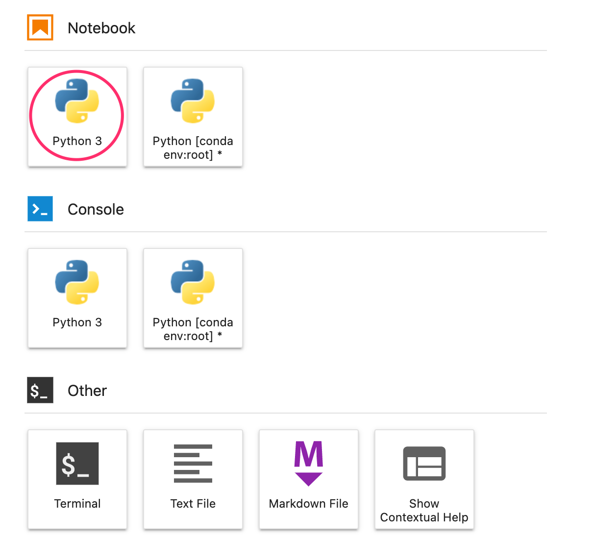

You can access the Launcher menu by clicking on the **+** sign in the top left
of your notebook instance.

To install both services we'll be using in this lab, first set the user flag in
a notebook cell:

```
USER_FLAG = "--user"
```

Then run the following from your notebook:

```
!pip install {USER_FLAG} "tfx[kfp]==1.5" --upgrade
```

After installing these packages you'll need to restart the kernel:

```
import os

if not os.getenv("IS_TESTING"):
    # Automatically restart kernel after installs
    import IPython

    app = IPython.Application.instance()
    app.kernel.do_shutdown(True)
```

Finally, check that you have correctly installed the packages. The TFX SDK
version should be >=1.5:

```
!python3 -c "import tfx; print('TFX SDK version: {}'.format(tfx.__version__))"
```

### Step 2: Set your project ID and bucket

Throughout this lab you'll reference your Cloud project ID and the bucket you
created earlier. Next we'll create variables for each of those.

If you don't know your project ID you may be able to get it by running the
following:

```
import os
PROJECT_ID = ""

# Get your Google Cloud project ID from gcloud
if not os.getenv("IS_TESTING"):
    shell_output=!gcloud config list --format 'value(core.project)' 2>/dev/null
    PROJECT_ID = shell_output[0]
    print("Project ID: ", PROJECT_ID)
```

Otherwise, set it here:

```
if PROJECT_ID == "" or PROJECT_ID is None:
    PROJECT_ID = "your-project-id"  # @param {type:"string"}
```

Then create a variable to store your bucket name. If you created it in this lab,
the following will work. Otherwise, you'll need to set this manually:

```
BUCKET_NAME="gs://" + PROJECT_ID + "-bucket"
```

### Step 3: Download the data

We will be using a subset of the
[CIFAR-10 dataset](https://www.cs.toronto.edu/~kriz/cifar.html) which has
already been preprocessed into TFRecords.

```
!wget https://github.com/tensorflow/tfx/raw/master/tfx/examples/cifar10/data/test/cifar10_test.tfrecord -P data/test/
!wget https://github.com/tensorflow/tfx/raw/master/tfx/examples/cifar10/data/train/cifar10_train.tfrecord -P data/train/
!wget https://raw.githubusercontent.com/tensorflow/tfx/master/tfx/examples/cifar10/data/labels.txt -P data/
```

## Introduction to TFX Components

Duration: 20:00

A **component** is an implementation of an ML task that you can use as a step in
your TFX pipeline. TFX provides several
[standard components](https://www.tensorflow.org/tfx/guide#tfx_standard_components)
that you can use in your pipelines. If these components do not meet your needs,
you can build
[custom components](https://www.tensorflow.org/tfx/guide/understanding_custom_components)

The outputs of steps in a TFX pipeline are called **artifacts**. Subsequent
steps in your workflow maybe use these artifacts as inputs. In this way, TFX
lets you transfter data between workflow steps.

We'll present a high level overview of the TFX components:

-   ExampleGen
-   StatisticsGen
-   SchemaGen
-   ExampleValidator
-   Transform
-   Trainer
-   Tuner
-   Evaluator
-   InfraValidator
-   Pusher
-   BulkInferer


### The ExampleGen component

The ExampleGen component ingests data into TFX pipelines. In consumes external
files/services to generate Examples which will be read by other TFX components.
It also provides consistent and configurable partition, and shuffles the dataset
for ML best practice.

\* Consumes: Data from external data sources such as CSV, TFRecord, Avro,
Parquet and BigQuery.

\* Emits: tf.Example records, tf.SequenceExample records, or proto format,
depending on the payload format.

```
from tfx import v1 as tfx
from tfx.components import ImportExampleGen
from tfx.proto import example_gen_pb2

input_config = example_gen_pb2.Input(splits=[
    example_gen_pb2.Input.Split(name='train', pattern='train/*'),
    example_gen_pb2.Input.Split(name='eval', pattern='test/*')
])

example_gen = ImportExampleGen(
    input_base=data_root, input_config=input_config)

```

`input_config` is an optional parameter used when data has been pre-split in a
previous operation. If this parameter is omitted, the ExampleGen component will
automatically split an shuffle the data. If you like to know more about how
ExampleGen splits the data see this
[link](https://www.tensorflow.org/tfx/guide/examplegen#span_version_and_split)

### The StatisticsGen component

The StatisticsGen component generates features statistics over both training and
serving data, which can be used by other pipeline components. StatisticsGen uses
Beam to scale to large datasets.

\* Consumes: datasets created by an ExampleGen pipeline component.

\* Emits: Dataset statistics.

```
from tfx import v1 as tfx
from tfx.components import StatisticsGen

statistics_gen = StatisticsGen(examples=example_gen.outputs['examples'])
```

### The SchemaGen component

Some TFX components use a description of your input data called a schema. The
schema is an instance of schema.proto. It can specify data types for feature
values, whether a feature has to be present in all examples, allowed value
ranges, and other properties. A SchemaGen pipeline component will automatically
generate a schema by inferring types, categories, and ranges from the training
data.

\* Consumes: statistics from a StatisticsGen component

\* Emits: Data schema proto

```
from tfx import v1 as tfx
from tfx.components import SchemaGen

schema_gen = SchemaGen(
      statistics=statistics_gen.outputs['statistics'], infer_feature_shape=True)
```

### The ExampleValidator component

The ExampleValidator component identifies anomalies in training and serving
data. It can detect different classes of anomalies in the data. For example it
can:

\* Perform validity checks by comparing data statistics against a schema that
codifies expectations of the user

\* Detect training-serving skew by comparing training and serving data

\* Detect data drift by looking at a series of data

The ExampleValidator component:

\* Consumes: A schema from a SchemaGen component, and statistics from a
StatisticsGen component

\* Emits: Validation results

```
from tfx import v1 as tfx
from tfx.components import ExampleValidator

example_validator = ExampleValidator(
      statistics=statistics_gen.outputs['statistics'],
      schema=schema_gen.outputs['schema'])
```

### The Transform component

The Transform component performs feature engineering on tf.Examples emitted from
an ExampleGen component, using a data schema created by a SchemaGen component,
and emits both a SavedModel as well as statistics on both pre-transform and
post-transform data. When executed, the SavedModel will accept tf.Examples
emmited from an ExampleGen component and emit the transformed feature data.

\* Consumes: tf.Examples from an ExampleGen component, and a data schema from a
SchemaGen component.

\* Emits: A SavedModel to a Trainer component, pre-transform and post-transform
statistics.

```
from tfx import v1 as tfx
from tfx.components import Transform

transform = Transform(
      examples=example_gen.outputs['examples'],
      schema=schema_gen.outputs['schema'],
      module_file=module_file)
```

### The Trainer component

The Trainer TFX pipeline component trains a TensorFlow model.

\* Consumes:

-   tf.Examples used for training and eval
-   A user provided module file that defines the trainer logic
-   Protobuf definition of train args and eval args
-   (Optional) A data schema created by a SchemaGen pipeline component
-   (Optional) Transform graph produced by an upstream Transform component
-   (Optional) Pre-trained models used for scenarios such as warmstart
-   (Optional) Hyperparameters, which will be passed to use module function.

\* Emits: At least one model for inference/serving (typically in
SavedModelFormat) and optionally another model for eval (typlically an
EvalSavedModel)

```
from tfx import v1 as tfx
from tfx.components import Trainer
from tfx.proto import trainer_pb2

trainer = Trainer(
    module_file=module_file,
    examples=transform.outputs['transformed_examples'],
    transform_graph=transform.outputs['transform_graph'],
    schema=schema_gen.outputs['schema'],
    base_model=model_resolver.outputs['model'],
    train_args=trainer_pb2.TrainArgs(num_steps=160),
    eval_args=trainer_pb2.EvalArgs(num_steps=4),
    custom_config={'labels_path': labels_path})

```

### The Tuner Component

The Tuner component tunes the hyperparameters for the model

\* Consumes:

-   tf.Examples used for training and eval
-   A user provided module file (or module fn) that defines the tuning logic,
    including model definition, hyperparameter search space, objective etc
-   Protobuf definition of training args and eval args
-   (Optional) Protobuf definition of tuning args
-   (Optional) Transform graph produced by an upstream Transform component
-   (Optional) A data schema created by a SchemaGen pipeline component and
    optionally altered by the developer

\* Emits: the best hyperparameter results

```
from tfx import v1 as tfx
from tfx.components import Tuner
from tfx.components import Trainer

tuner = Tuner(
    module_file=module_file,  # Contains `tuner_fn`.
    examples=transform.outputs['transformed_examples'],
    transform_graph=transform.outputs['transform_graph'],
    train_args=trainer_pb2.TrainArgs(num_steps=20),
    eval_args=trainer_pb2.EvalArgs(num_steps=5))

trainer = Trainer(
    module_file=module_file,  # Contains `run_fn`.
    examples=transform.outputs['transformed_examples'],
    transform_graph=transform.outputs['transform_graph'],
    schema=schema_gen.outputs['schema'],
    # This will be passed to `run_fn`.
    hyperparameters=tuner.outputs['best_hyperparameters'],
    train_args=trainer_pb2.TrainArgs(num_steps=100),
    eval_args=trainer_pb2.EvalArgs(num_steps=5))
```

### The Evaluator component

The Evaluator component performs deep analysis on the training results for your
models, to help you understand how your model performs on subsets of your data.
The Evaluator also helps you validate your exported models, ensuring that they
are "good enough" to be pushed to production.

\* Consumes:

-   An eval split from ExampleGen

-   A trained model from Trainer

-   (Optional) A previously blessed model

\* Emits:

-   Analysis results to ML Metadata

-   Validation results to ML Metadata

```
from tfx import v1 as tfx
from tfx.components import Evaluator
import tensorflow_model_analysis as tfma

eval_config = tfma.EvalConfig(
      model_specs=[tfma.ModelSpec(label_key='label')],
      slicing_specs=[tfma.SlicingSpec()],
      metrics_specs=[
          tfma.MetricsSpec(metrics=[
              tfma.MetricConfig(
                  class_name='SparseCategoricalAccuracy',
                  threshold=tfma.MetricThreshold(
                      value_threshold=tfma.GenericValueThreshold(
                          lower_bound={'value': 0.55}),
                      # Change threshold will be ignored if there is no
                      # baseline model resolved from MLMD (first run).
                      change_threshold=tfma.GenericChangeThreshold(
                          direction=tfma.MetricDirection.HIGHER_IS_BETTER,
                          absolute={'value': -1e-3})))
          ])
      ])
```

### The InfraValidator component

InfraValidator is a TFX component that is used as an early warning layer before
pushing a model into production. The name "infra" validator came from the fact
that it is validating the model in the actual model serving "infrastructure". If
Evaluator is to guarantee the performance of the model, InfraValidator is to
guarantee the model is mechanically fine and prevents bad models from being
pushed.

\* Consumes: a trained model in SavedModel format from the Trainer component

\* Emits: infra validation result

```
from tfx import v1 as tfx
from tfx.components import InfraValidator

infra_validator = InfraValidator(
    model=trainer.outputs['model'],
    serving_spec=tfx.proto.ServingSpec(...)
)
```

### The Pusher component

The Pusher component is used to push a validated model to a deployment target
during model training or re-training. Before the deployment, Pusher relies on
one or more blessings from other validation components to decide whether to push
the model or not.

\* Consumes:

-   A trained model from the Trainer component
-   (Optional but recommended) InfraValidator blesses the model if the model is
    mechanically servable in a production environment

\* Emits: the same trained model along with versioning metadata

```
from tfx import v1 as tfx
from tfx.components import Pusher
from tfx.proto import pusher_pb2

pusher = Pusher(
    model=trainer.outputs['model'],
    model_blessing=evaluator.outputs['blessing'],
    push_destination=pusher_pb2.PushDestination(
        filesystem=pusher_pb2.PushDestination.Filesystem(
            base_directory=serving_model_dir_lite)))
```

### BulkInferrer

The BulkInferrer TFX component performs batch inference on unlabeled data. The
generated InferenceResult contains the original features and the prediction
results.

\* Consumes:

-   A trained model in SavedModel format
-   Unlabelled tf.Examples that contain features
-   (Optional) Validation results from Evaluator component

\* Emits: InferenceResults

```
from tfx import v1 as tfx
from tfx.components import BulkInferer

bulk_inferrer = BulkInferrer(
    examples=examples_gen.outputs['examples'],
    model=trainer.outputs['model'],
    model_blessing=evaluator.outputs['blessing'],
    data_spec=bulk_inferrer_pb2.DataSpec(),
    model_spec=bulk_inferrer_pb2.ModelSpec()
)
```

## Creating your first pipeline

To get familiar with how TFX works, we'll first create a local pipeline. This
pipeline runs inside the jupyter notebook.

TFX uses Apache Beam, to parallelize certain tasks, such as data ingestion, data
statistics generation and perform data transformations. TFX also creates a
metadata store that tracks pipeline lineage across all experiments and component
artifacts.

### Step 1: Import libraries

Add the following to import the libraries we'll be using throughout this
section:

```
from __future__ import absolute_import
from __future__ import division
from __future__ import print_function

import logging
import os
from typing import List, Text

import absl
from tfx import v1 as tfx
import tensorflow_model_analysis as tfma
from tfx.components import Evaluator
from tfx.components import ExampleValidator
from tfx.components import ImportExampleGen
from tfx.components import Pusher
from tfx.components import SchemaGen
from tfx.components import StatisticsGen
from tfx.components import Trainer
from tfx.components import Transform
from tfx.dsl.components.common import resolver
from tfx.dsl.experimental import latest_blessed_model_resolver
from tfx.orchestration import metadata
from tfx.orchestration import pipeline
from tfx.orchestration.beam.beam_dag_runner import BeamDagRunner
from tfx.proto import example_gen_pb2
from tfx.proto import pusher_pb2
from tfx.proto import trainer_pb2
from tfx.types import Channel
from tfx.types.standard_artifacts import Model
from tfx.types.standard_artifacts import ModelBlessing
```

### Step 2: Define constants

We need to define the various paths where we will be storing our pipeline data,
artifacts, metadata and trained model.

```
_pipeline_name = 'cifar10_native_keras'

_cifar10_root = os.path.join(os.getcwd())

_data_root = os.path.join(_cifar10_root, 'data')

# Python module files to inject customized logic into the TFX components. The
# Transform and Trainer both require user-defined functions to run successfully.
_module_file = os.path.join(_cifar10_root, 'cifar10_utils_native_keras.py')

# Path which can be listened to by the model server. Pusher will output the
# trained model here.
_serving_model_dir_lite = os.path.join(_cifar10_root, 'serving_model_lite',
                                       _pipeline_name)

_tfx_root = os.path.join(os.getcwd(), 'tfx')
_pipeline_root = os.path.join(_tfx_root, 'pipelines', _pipeline_name)
# Sqlite ML-metadata db path.
_metadata_path = os.path.join(_tfx_root, 'metadata', _pipeline_name,
                              'metadata.db')
# Path to labels file for mapping model outputs.
_labels_path = os.path.join(_data_root, 'labels.txt')
```

### Step 3: Define Beam Pipeline Arguments

TFX uses Beam to parallelize certain workloads. We will be using the local Beam
runner.

```
_beam_pipeline_args = [
    '--direct_running_mode=multi_processing',
    '--direct_num_workers=0',
]
```

### Step 4: Create the TFX components

We will not be using all the components described in the previous section. We
will focus on the following:

-   ExampleGen
-   StatisticsGen
-   SchemaGen
-   ExampleValidator
-   Transform
-   Trainer
-   Evaluator
-   Pusher

```
input_config = example_gen_pb2.Input(splits=[
      example_gen_pb2.Input.Split(name='train', pattern='train/*'),
      example_gen_pb2.Input.Split(name='eval', pattern='test/*')
  ])

# Brings data into the pipeline.
example_gen = ImportExampleGen(
    input_base=_data_root, input_config=input_config)

# Computes statistics over data for visualization and example validation.
statistics_gen = StatisticsGen(examples=example_gen.outputs['examples'])

# Generates schema based on statistics files.
schema_gen = SchemaGen(
    statistics=statistics_gen.outputs['statistics'], infer_feature_shape=True)

# Performs anomaly detection based on statistics and data schema.
example_validator = ExampleValidator(
    statistics=statistics_gen.outputs['statistics'],
    schema=schema_gen.outputs['schema'])

# Performs transformations and feature engineering in training and serving.
transform = Transform(
    examples=example_gen.outputs['examples'],
    schema=schema_gen.outputs['schema'],
    module_file=_module_file)

model_resolver = resolver.Resolver(
  #instance_name='latest_model_resolver',
  strategy_class=tfx.dsl.experimental.LatestArtifactStrategy,
  model=Channel(type=Model)).with_id('latest_blessed_model_resolver')

trainer = Trainer(
    module_file=_module_file,
    examples=transform.outputs['transformed_examples'],
    transform_graph=transform.outputs['transform_graph'],
    schema=schema_gen.outputs['schema'],
    base_model=model_resolver.outputs['model'],
    train_args=trainer_pb2.TrainArgs(num_steps=160),
    eval_args=trainer_pb2.EvalArgs(num_steps=4),
    custom_config={'labels_path': _labels_path})

eval_config = tfma.EvalConfig(
    model_specs=[tfma.ModelSpec(label_key='label')],
    slicing_specs=[tfma.SlicingSpec()],
    metrics_specs=[
        tfma.MetricsSpec(metrics=[
            tfma.MetricConfig(
                class_name='SparseCategoricalAccuracy',
                threshold=tfma.MetricThreshold(
                    value_threshold=tfma.GenericValueThreshold(
                        lower_bound={'value': 0.55}),
                    # Change threshold will be ignored if there is no
                    # baseline model resolved from MLMD (first run).
                    change_threshold=tfma.GenericChangeThreshold(
                        direction=tfma.MetricDirection.HIGHER_IS_BETTER,
                        absolute={'value': -1e-3})))
        ])
    ])

evaluator = Evaluator(
    examples=example_gen.outputs['examples'],
    model=trainer.outputs['model'],
    #baseline_model=model_resolver.outputs['model'],
    eval_config=eval_config)

pusher = Pusher(
    model=trainer.outputs['model'],
    model_blessing=evaluator.outputs['blessing'],
    push_destination=pusher_pb2.PushDestination(
        filesystem=pusher_pb2.PushDestination.Filesystem(
            base_directory=_serving_model_dir_lite)))
```

Note that we introduced a new concept, the TFX node Resolver. The Resolver
handles special artifact resolution logics that will be used as inputs for
downstream notes. In this case, it will look for a previously blessed model and
pass it to the Trainer component so that we can do warm start or continuous
training.

### Step 5: Create the Pipeline

Pipeline is an object that builds the pipeline definition. It orders components
based on upstream dependencies even if components are set out of order.

The Pipeline object also takes in a metadata_connection_config that lets us
define where our metadata store is located as well as Beam pipeline arguments.

```
components = [
    example_gen, statistics_gen, schema_gen, example_validator, transform,
    trainer, model_resolver, evaluator, pusher
]

pipeline = pipeline.Pipeline(
    pipeline_name=_pipeline_name,
    pipeline_root=_pipeline_root,
    components=components,
    enable_cache=True,
    metadata_connection_config=metadata.sqlite_metadata_connection_config(
        _metadata_path),
    beam_pipeline_args=_beam_pipeline_args)
```

### Step 6: The Transform and Trainer module file

The Transform and Trainer components require a module file with the code
definition for how each one will respectively transform the data and train the
model. We create one file with both of these requirements.

The Transform component requires a python file with a function name `def
preprocessing_fn`, while Trainer requires a python file with a function name
`def run_fn`. The path of the file is passed to each component via the
`module_file` parameter.

Run the following code snippet in a single Notebook block.

```
%%writefile cifar10_utils_native_keras.py


# Lint as: python2, python3
# Copyright 2019 Google LLC. All Rights Reserved.
#
# Licensed under the Apache License, Version 2.0 (the "License");
# you may not use this file except in compliance with the License.
# You may obtain a copy of the License at
#
#     https://www.apache.org/licenses/LICENSE-2.0
#
# Unless required by applicable law or agreed to in writing, software
# distributed under the License is distributed on an "AS IS" BASIS,
# WITHOUT WARRANTIES OR CONDITIONS OF ANY KIND, either express or implied.
# See the License for the specific language governing permissions and
# limitations under the License.
"""Python source file includes CIFAR10 utils for Keras model.

The utilities in this file are used to build a model with native Keras.
This module file will be used in Transform and generic Trainer.
"""

from __future__ import absolute_import
from __future__ import division
from __future__ import print_function

import os
from typing import List, Text
import absl
import tensorflow as tf
import tensorflow_transform as tft

from tfx.components.trainer.fn_args_utils import DataAccessor
from tfx.components.trainer.fn_args_utils import FnArgs
from tfx.components.trainer.rewriting import converters
from tfx.components.trainer.rewriting import rewriter
from tfx.components.trainer.rewriting import rewriter_factory
from tfx.dsl.io import fileio
from tfx_bsl.tfxio import dataset_options

# When training on the whole dataset use following constants instead.
# This setting should give ~91% accuracy on the whole test set
# _TRAIN_DATA_SIZE = 50000
# _EVAL_DATA_SIZE = 10000
# _TRAIN_BATCH_SIZE = 64
# _EVAL_BATCH_SIZE = 64
# _CLASSIFIER_LEARNING_RATE = 3e-4
# _FINETUNE_LEARNING_RATE = 5e-5
# _CLASSIFIER_EPOCHS = 12

_TRAIN_DATA_SIZE = 128
_EVAL_DATA_SIZE = 128
_TRAIN_BATCH_SIZE = 32
_EVAL_BATCH_SIZE = 32
_CLASSIFIER_LEARNING_RATE = 1e-3
_FINETUNE_LEARNING_RATE = 7e-6
_CLASSIFIER_EPOCHS = 30

_IMAGE_KEY = 'image'
_LABEL_KEY = 'label'

def _transformed_name(key):
    # This makes it easier for continuous training since mobilenet's input layer is input_1
    if key == _IMAGE_KEY:
      return 'input_1'
    else:
      return key + '_xf'


def _get_serve_image_fn(model, tf_transform_output):
  """Returns a function that feeds the input tensor into the model."""
  model.tft_layer = tf_transform_output.transform_features_layer()
  @tf.function
  def serve_image_fn(serialized_tf_examples):

    feature_spec = tf_transform_output.raw_feature_spec()
    feature_spec.pop(_LABEL_KEY)
    parsed_features = tf.io.parse_example(serialized_tf_examples, feature_spec)

    transformed_features = model.tft_layer(parsed_features)
    #del transformed_features[_transformed_name(_IMAGE_KEY)]

    return model(transformed_features)

  return serve_image_fn


def _image_augmentation(image_features):
  """Perform image augmentation on batches of images .

  Args:
    image_features: a batch of image features

  Returns:
    The augmented image features
  """
  batch_size = tf.shape(image_features)[0]
  image_features = tf.image.random_flip_left_right(image_features)
  image_features = tf.image.resize_with_crop_or_pad(image_features, 36, 36)
  image_features = tf.image.random_crop(image_features,
                                        (batch_size, 32, 32, 3))
  return image_features


def _data_augmentation(feature_dict):
  """Perform data augmentation on batches of data.

  Args:
    feature_dict: a dict containing features of samples

  Returns:
    The feature dict with augmented features
  """
  image_features = feature_dict[_transformed_name(_IMAGE_KEY)]
  image_features = _image_augmentation(image_features)
  feature_dict[_transformed_name(_IMAGE_KEY)] = image_features
  return feature_dict


def _input_fn(file_pattern: List[Text],
              data_accessor: DataAccessor,
              tf_transform_output: tft.TFTransformOutput,
              is_train: bool = False,
              batch_size: int = 200) -> tf.data.Dataset:
  """Generates features and label for tuning/training.

  Args:
    file_pattern: List of paths or patterns of input tfrecord files.
    data_accessor: DataAccessor for converting input to RecordBatch.
    tf_transform_output: A TFTransformOutput.
    is_train: Whether the input dataset is train split or not.
    batch_size: representing the number of consecutive elements of returned
      dataset to combine in a single batch

  Returns:
    A dataset that contains (features, indices) tuple where features is a
      dictionary of Tensors, and indices is a single Tensor of label indices.
  """
  dataset = data_accessor.tf_dataset_factory(
      file_pattern,
      dataset_options.TensorFlowDatasetOptions(
          batch_size=batch_size, label_key=_transformed_name(_LABEL_KEY)),
      tf_transform_output.transformed_metadata.schema)
  # Apply data augmentation. We have to do data augmentation here because
  # we need to apply data agumentation on-the-fly during training. If we put
  # it in Transform, it will only be applied once on the whole dataset, which
  # will lose the point of data augmentation.
  if is_train:
    dataset = dataset.map(lambda x, y: (_data_augmentation(x), y))

  return dataset


def _freeze_model_by_percentage(model: tf.keras.Model, percentage: float):
  """Freeze part of the model based on specified percentage.

  Args:
    model: The keras model need to be partially frozen
    percentage: the percentage of layers to freeze

  Raises:
    ValueError: Invalid values.
  """
  if percentage < 0 or percentage > 1:
    raise ValueError('Freeze percentage should between 0.0 and 1.0')

  if not model.trainable:
    raise ValueError(
        'The model is not trainable, please set model.trainable to True')

  num_layers = len(model.layers)
  num_layers_to_freeze = int(num_layers * percentage)
  for idx, layer in enumerate(model.layers):
    if idx < num_layers_to_freeze:
      layer.trainable = False
    else:
      layer.trainable = True


def _build_keras_model() -> tf.keras.Model:
  """Creates a Image classification model with MobileNet backbone.

  Returns:
    The image classification Keras Model and the backbone MobileNet model
  """
  # We create a MobileNet model with weights pre-trained on ImageNet.
  # We remove the top classification layer of the MobileNet, which was
  # used for classifying ImageNet objects. We will add our own classification
  # layer for CIFAR10 later. We use average pooling at the last convolution
  # layer to get a 1D vector for classification, which is consistent with the
  # origin MobileNet setup
  base_model = tf.keras.applications.MobileNet(
      input_shape=(32, 32, 3),
      include_top=False,
      weights='imagenet',
      pooling='avg')
  base_model.input_spec = None

  # We add a Dropout layer at the top of MobileNet backbone we just created to
  # prevent overfiting, and then a Dense layer to classifying CIFAR10 objects
  model = tf.keras.Sequential([
      tf.keras.layers.InputLayer(
          input_shape=(32, 32, 3), name=_transformed_name(_IMAGE_KEY)),
      base_model,
      tf.keras.layers.Dropout(0.1),
      tf.keras.layers.Dense(10, activation='softmax')
  ])

  # Freeze the whole MobileNet backbone to first train the top classifier only
  _freeze_model_by_percentage(base_model, 1.0)

  model.compile(
      loss='sparse_categorical_crossentropy',
      optimizer=tf.keras.optimizers.RMSprop(lr=_CLASSIFIER_LEARNING_RATE),
      metrics=['sparse_categorical_accuracy'])
  model.summary(print_fn=absl.logging.info)

  return model, base_model


# TFX Transform will call this function.
def preprocessing_fn(inputs):
  """tf.transform's callback function for preprocessing inputs.

  Args:
    inputs: map from feature keys to raw not-yet-transformed features.

  Returns:
    Map from string feature key to transformed feature operations.
  """
  outputs = {}

  # tf.io.decode_png function cannot be applied on a batch of data.
  # We have to use tf.map_fn
  image_features = tf.map_fn(
      lambda x: tf.io.decode_png(x[0], channels=3),
      inputs[_IMAGE_KEY],
      dtype=tf.uint8)
  image_features = tf.image.resize(image_features, [32, 32])
  image_features = tf.keras.applications.mobilenet.preprocess_input(
      image_features)

  outputs[_transformed_name(_IMAGE_KEY)] = image_features
  # Do not apply label transformation as it will result in wrong evaluation.
  outputs[_transformed_name(_LABEL_KEY)] = inputs[_LABEL_KEY]

  return outputs

# TFX Trainer will call this function.
def run_fn(fn_args: FnArgs):
    """Train the model based on given args.

    Args:
    fn_args: Holds args used to train the model as name/value pairs.

    Raises:
    ValueError: if invalid inputs.
    """
    tf_transform_output = tft.TFTransformOutput(fn_args.transform_output)

    strategy = tf.distribute.MirroredStrategy(devices=['device:GPU:0'])

    baseline_path = fn_args.base_model
    if baseline_path is not None:
        with strategy.scope():
            model = tf.keras.models.load_model(os.path.join(baseline_path))
            # rename input layer to match transform name
            #model.layers[0].layers[0]._name = _transformed_name(_IMAGE_KEY)
    else:
        with strategy.scope():
            model, base_model = _build_keras_model()

    train_dataset = _input_fn(
        fn_args.train_files,
        fn_args.data_accessor,
        tf_transform_output,
        is_train=True,
        batch_size=_TRAIN_BATCH_SIZE)
    eval_dataset = _input_fn(
        fn_args.eval_files,
        fn_args.data_accessor,
        tf_transform_output,
        is_train=False,
        batch_size=_EVAL_BATCH_SIZE)

    absl.logging.info('TensorBoard logging to {}'.format(fn_args.model_run_dir))
    # Write logs to path
    tensorboard_callback = tf.keras.callbacks.TensorBoard(
        log_dir=fn_args.model_run_dir, update_freq='batch')

    # Our training regime has two phases: we first freeze the backbone and train
    # the newly added classifier only, then unfreeze part of the backbone and
    # fine-tune with classifier jointly.
    steps_per_epoch = int(_TRAIN_DATA_SIZE / _TRAIN_BATCH_SIZE)
    total_epochs = int(fn_args.train_steps / steps_per_epoch)
    if _CLASSIFIER_EPOCHS > total_epochs:
        raise ValueError('Classifier epochs is greater than the total epochs')

    absl.logging.info('Start training the top classifier')
    model.fit(
        train_dataset,
        epochs=_CLASSIFIER_EPOCHS,
        steps_per_epoch=steps_per_epoch,
        validation_data=eval_dataset,
        validation_steps=fn_args.eval_steps,
        callbacks=[tensorboard_callback])

    # only if first training, finetune.
    # TODO - LR could be improved
    if baseline_path is None:
        absl.logging.info('Start fine-tuning the model')
        # Unfreeze the top MobileNet layers and do joint fine-tuning
        _freeze_model_by_percentage(base_model, 0.9)

        # We need to recompile the model because layer properties have changed
        model.compile(
            loss='sparse_categorical_crossentropy',
            optimizer=tf.keras.optimizers.RMSprop(lr=_FINETUNE_LEARNING_RATE),
            metrics=['sparse_categorical_accuracy'])
        model.summary(print_fn=absl.logging.info)

        model.fit(
            train_dataset,
            initial_epoch=_CLASSIFIER_EPOCHS,
            epochs=total_epochs,
            steps_per_epoch=steps_per_epoch,
            validation_data=eval_dataset,
            validation_steps=fn_args.eval_steps,
            callbacks=[tensorboard_callback])

    signatures = {
      'serving_default':
          _get_serve_image_fn(model,tf_transform_output).get_concrete_function(
              tf.TensorSpec(
                  shape=[None],
                  dtype=tf.string,
                  name=_IMAGE_KEY))
    }

    temp_saving_model_dir = os.path.join(fn_args.serving_model_dir)
    model.save(temp_saving_model_dir, save_format='tf', signatures=signatures)
```

### Step 7: Run the Pipeline

TFX supports multiple orchestrators such as Beam, Airflow and Kubeflow. For
local pipelines, we will use the BeamRunner.

```
BeamDagRunner().run(pipeline)
```

The pipeline should take about 10 minutes to run. Warnings can be ignored.

After it is finished running, there is a newly created folder `tfx` with two
folders inside, `metadata` where the sqlite metadata store is stored and
`pipelines` where all component artifacts are located.

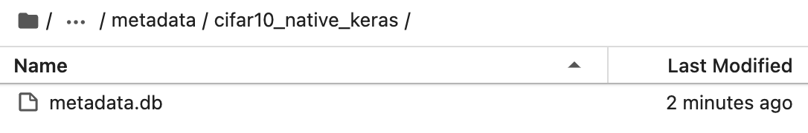

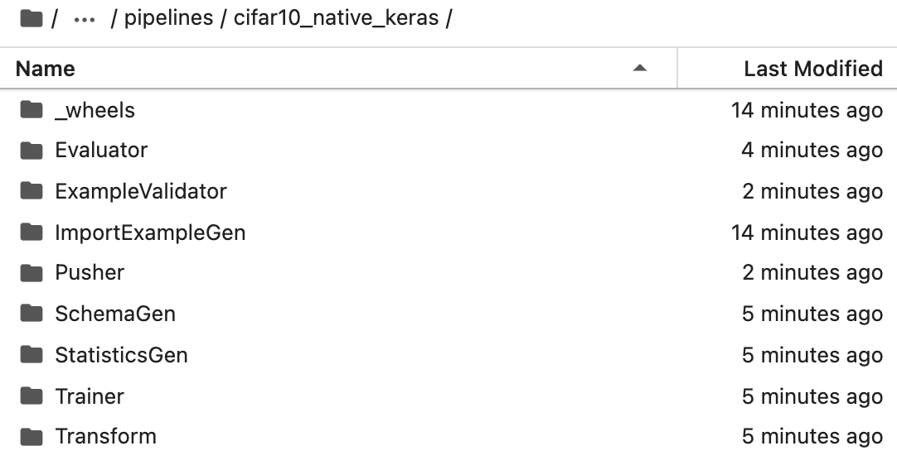

### Step 8 (Optional): Load and Visualize StatisticsGen Artifact

We can visualize some of the StatisticsGen Artifact and compare our train and
eval datasets. This visualization tool is very useful to give us insights about
the data such as data distribution and possible data skew.

```
import os
from os import listdir
import tensorflow_data_validation as tfdv

path = "tfx/pipelines/cifar10_native_keras/StatisticsGen/statistics/"
stats_run = os.path.join(path,[f for f in listdir(path)][0])
train_stats_filepath = os.path.join(stats_run,"Split-train","FeatureStats.pb")
eval_stats_filepath = os.path.join(stats_run,"Split-eval","FeatureStats.pb")

train_stats = tfdv.load_stats_binary(train_stats_filepath)
eval_stats = tfdv.load_stats_binary(eval_stats_filepath)

tfdv.visualize_statistics(train_stats,rhs_statistics=eval_stats,lhs_name="train",rhs_name="eval")
```

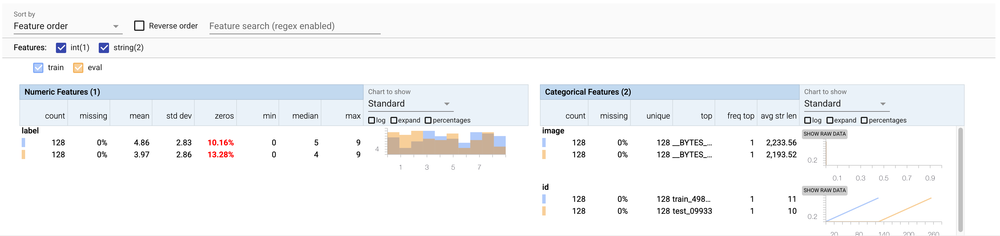

## Running your pipeline in Vertex AI

It's time to run the pipeline in Vertex AI. The Vertex AI pipeline will run in
the cloud and deploy a model to a Vertex AI endpoint. All metadata will be
stored in the Vertex AI Metadata store.

With a few modifications to our code this pipeline can be deployed in Vertex.

-   Define constants with cloud paths instead of local ones
-   Copy the data to our GCS bucket
-   Copy the Transform and Trainer module to our GCS bucket
-   Create Service Account Key
-   Change our Beam arguments to use the DataflowRunner
-   Change the Trainer and Pusher components to use google_cloud_ai_platform
    extensions.

    **Note: Steps 4 and 5 are outlines. The last step will have the fully built
    pipeline definition with those included**

### Step 1: Define Constants

First we define constants that are needed by Dataflow and TFX.

**Do not forget to fill in the PROJECT_ID**

```
PROJECT_ID = ""
BUCKET_NAME="gs://" + PROJECT_ID + "-bucket"
REGION="us-central1"
DATA_FOLDER=f"{BUCKET_NAME}/cifar_data/"
TRAINER_MODULE=f"{BUCKET_NAME}/cifar_data/cifar10_utils_native_keras.py"
REGION="us-central1"
DATA_FOLDER=f"{BUCKET_NAME}/cifar_data/"
TRAINER_MODULE=f"{BUCKET_NAME}/cifar_data/cifar10_utils_native_keras.py"
```

### Step 2: Copy the Data to Google Cloud Storage

In a notebook cell, run the following.

```
!export CLOUDSDK_PYTHON=python3 && gsutil cp -r data/* $DATA_FOLDER
```

### Step 3: Copy The Transform and Trainer module to Google Cloud Storage

```
!export CLOUDSDK_PYTHON=python3 && gsutil cp cifar10_utils_native_keras.py $TRAINER_MODULE
```

### Step 4: Create Service Account Key

Earlier we created a new service account. We will create a key and set it as the
account that we will be using as well as use it to create the Vertex AI
pipeline.

In a new cell block execute the following. Make sure to change <YOUR_PROJECT_ID>
with your project id.

```
!export CLOUDSDK_PYTHON=python3 && gcloud iam service-accounts keys create my-sa-key.json --iam-account=vertexai-test@<YOUR_PROJECT_ID>.iam.gserviceaccount.com
```

**Note: Usually we do not want to store a Service Account key in the same folder
where the code resides. For simplicity, we are doing so.**

Then set GOOGLE_APPLICATION_CREDENTIALS to your newly created key.

```
%env GOOGLE_APPLICATION_CREDENTIALS=my-sa-key.json
```

### Step 4: Change the Beam Arguments

```
_beam_pipeline_args = [
    '--runner=DataflowRunner',
    f"--project={PROJECT_ID}",
    f"--temp_location={BUCKET_NAME}/tmp/",
    f"--region={REGION}",
    '--disk_size_gb=50',
    '--machine-type=n2d-standard-2',
    f"--service_account_email=vertexai-test@{PROJECT_ID}.iam.gserviceaccount.com",
    '--experiments=use_runner_v2'
]
```

### Step 5: Change the Trainer and Pusher Components

Google provides components that are inheritenly same plus provide functionality
to run them in Vertex AI.

For this job, we will be using a GPU for training.

The Trainer component now looks like.

```
vertex_job_spec = {
      'project': PROJECT_ID,
      'worker_pool_specs' : [
          {
            'machine_spec': {
              'machine_type' : 'n1-standard-4',
              'accelerator_type' : 5, #NVIDIA_TESLA_T4
              'accelerator_count' : 1
            },
            'replica_count' : 1,
            'container_spec' : {
              'image_uri' : 'gcr.io/tfx-oss-public/tfx:{}'.format(tfx.__version__)
            }
          }
      ]
  }

train_custom_config = {
  tfx.extensions.google_cloud_ai_platform.TRAINING_ARGS_KEY : vertex_job_spec,
  tfx.extensions.google_cloud_ai_platform.VERTEX_REGION_KEY : REGION, # must be us-central1 for vertexai
  tfx.extensions.google_cloud_ai_platform.ENABLE_VERTEX_KEY : True
}

train_custom_config['labels_path'] = labels_path

trainer = tfx.extensions.google_cloud_ai_platform.Trainer(
    module_file=module_file,
    examples=transform.outputs['transformed_examples'],
    transform_graph=transform.outputs['transform_graph'],
    schema=schema_gen.outputs['schema'],
    base_model=model_resolver.outputs['model'],
    train_args=trainer_pb2.TrainArgs(num_steps=160),
    eval_args=trainer_pb2.EvalArgs(num_steps=4),
    custom_config=train_custom_config)
```

The Pusher component.

```
pusher = tfx.extensions.google_cloud_ai_platform.Pusher(
  model=trainer.outputs['model'],
  model_blessing=evaluator.outputs['blessing'],
  custom_config={
    tfx.extensions.google_cloud_ai_platform.ENABLE_VERTEX_KEY: True,
    tfx.extensions.google_cloud_ai_platform.VERTEX_REGION_KEY: REGION,
    tfx.extensions.google_cloud_ai_platform.VERTEX_CONTAINER_IMAGE_URI_KEY: serving_image,
    tfx.extensions.google_cloud_ai_platform.SERVING_ARGS_KEY: vertex_serving_spec
  }
)
```

Notice the import paths are now from `tfx.extensions.google_cloud_ai_platform`

### Step 6: Complete Pipeline

In the complete pipeline we make the Pipeline creation as a function and define
a main function.

**Don't forget to define your BUCKET_NAME and PROJECT_ID in the code below.**

```
%%writefile pipeline.py

# Lint as: python2, python3
# Copyright 2019 Google LLC. All Rights Reserved.
#
# Licensed under the Apache License, Version 2.0 (the "License");
# you may not use this file except in compliance with the License.
# You may obtain a copy of the License at
#
#     http://www.apache.org/licenses/LICENSE-2.0
#
# Unless required by applicable law or agreed to in writing, software
# distributed under the License is distributed on an "AS IS" BASIS,
# WITHOUT WARRANTIES OR CONDITIONS OF ANY KIND, either express or implied.
# See the License for the specific language governing permissions and
# limitations under the License.

from __future__ import absolute_import
from __future__ import division
from __future__ import print_function

import logging
import os
from typing import List, Text

import absl
from tfx import v1 as tfx
import tensorflow_model_analysis as tfma
from tfx.components import Evaluator
from tfx.components import ExampleValidator
from tfx.components import ImportExampleGen
from tfx.components import SchemaGen
from tfx.components import StatisticsGen
from tfx.components import Transform
from tfx.dsl.components.common import resolver
from tfx.dsl.experimental import latest_blessed_model_resolver
from tfx.orchestration import metadata
from tfx.orchestration import pipeline
from tfx.orchestration.beam.beam_dag_runner import BeamDagRunner
from tfx.proto import example_gen_pb2
from tfx.proto import pusher_pb2
from tfx.proto import trainer_pb2
from tfx.types import Channel
from tfx.types.standard_artifacts import Model
from tfx.types.standard_artifacts import ModelBlessing

_pipeline_name = 'cifar10-native-keras'

BUCKET_NAME="gs://"
REGION="us-central1"
PROJECT_ID=""
DATA_FOLDER=f"{BUCKET_NAME}/cifar_data/"
TRAINER_MODULE=f"{BUCKET_NAME}/cifar_data/cifar10_utils_native_keras.py"

# This example assumes that CIFAR10 train set data is stored in
# ~/cifar10/data/train, test set data is stored in ~/cifar10/data/test, and
# the utility function is in ~/cifar10. Feel free to customize as needed.
_cifar10_root = BUCKET_NAME
_data_root = DATA_FOLDER
# Python module files to inject customized logic into the TFX components. The
# Transform and Trainer both require user-defined functions to run successfully.
_module_file = TRAINER_MODULE
# Path which can be listened to by the model server. Pusher will output the
# trained model here.
_serving_model_dir = f"{BUCKET_NAME}/serving_model/{_pipeline_name}"
# _serving_model_dir_lite = os.path.join(_cifar10_root, 'serving_model_lite',
#                                        _pipeline_name)

# Directory and data locations.  This example assumes all of the images,
# example code, and metadata library is relative to $HOME, but you can store
# these files anywhere on your local filesystem.
_tfx_root = f"{BUCKET_NAME}/tfx"
_pipeline_root = f"{_tfx_root}/pipelines/{_pipeline_name}"
# Path to labels file for mapping model outputs.
_labels_path = os.path.join(_data_root, 'labels.txt')


# Pipeline arguments for Beam powered Components.
_beam_pipeline_args = [
    '--runner=DataflowRunner',
    f"--project={PROJECT_ID}",
    f"--temp_location={BUCKET_NAME}/tmp/",
    f"--region={REGION}",
    '--disk_size_gb=50',
    '--machine-type=n2d-standard-2',
    f"--service_account_email=vertexai-test@{PROJECT_ID}.iam.gserviceaccount.com",
    '--experiments=use_runner_v2'
]


def _create_pipeline(pipeline_name: Text, pipeline_root: Text, data_root: Text,
                     module_file: Text, serving_model_dir_lite: Text,
                     labels_path: Text,
                     beam_pipeline_args: List[Text]) -> pipeline.Pipeline:
  """Implements the CIFAR10 image classification pipeline using TFX."""
  # This is needed for datasets with pre-defined splits
  # Change the pattern argument to train_whole/* and test_whole/* to train
  # on the whole CIFAR-10 dataset
  input_config = example_gen_pb2.Input(splits=[
      example_gen_pb2.Input.Split(name='train', pattern='train/*'),
      example_gen_pb2.Input.Split(name='eval', pattern='test/*')
  ])

  # Brings data into the pipeline.
  example_gen = ImportExampleGen(
      input_base=data_root, input_config=input_config)

  # Computes statistics over data for visualization and example validation.
  statistics_gen = StatisticsGen(examples=example_gen.outputs['examples'])

  # Generates schema based on statistics files.
  schema_gen = SchemaGen(
      statistics=statistics_gen.outputs['statistics'], infer_feature_shape=True)

  # Performs anomaly detection based on statistics and data schema.
  example_validator = ExampleValidator(
      statistics=statistics_gen.outputs['statistics'],
      schema=schema_gen.outputs['schema'])

  # Performs transformations and feature engineering in training and serving.
  transform = Transform(
      examples=example_gen.outputs['examples'],
      schema=schema_gen.outputs['schema'],
      module_file=module_file,
      force_tf_compat_v1=True
  )

  model_resolver = resolver.Resolver(
    #instance_name='latest_model_resolver',
    strategy_class=tfx.dsl.experimental.LatestArtifactStrategy,
    model=Channel(type=Model)).with_id('latest_blessed_model_resolver')

  # Uses user-provided Python function that trains a model.
  # When traning on the whole dataset, use 18744 for train steps, 156 for eval
  # steps. 18744 train steps correspond to 24 epochs on the whole train set, and
  # 156 eval steps correspond to 1 epoch on the whole test set. The
  # configuration below is for training on the dataset we provided in the data
  # folder, which has 128 train and 128 test samples. The 160 train steps
  # correspond to 40 epochs on this tiny train set, and 4 eval steps correspond
  # to 1 epoch on this tiny test set.
  vertex_job_spec = {
      'project': PROJECT_ID,
      'worker_pool_specs' : [
          {
            'machine_spec': {
              'machine_type' : 'n1-standard-4',
              'accelerator_type' : 5, #NVIDIA_TESLA_T4
              'accelerator_count' : 1
            },
            'replica_count' : 1,
            'container_spec' : {
              'image_uri' : 'gcr.io/tfx-oss-public/tfx:{}'.format(tfx.__version__)
            }
          }
      ]
  }

  train_custom_config = {
    tfx.extensions.google_cloud_ai_platform.TRAINING_ARGS_KEY : vertex_job_spec,
    tfx.extensions.google_cloud_ai_platform.VERTEX_REGION_KEY : REGION, # must be us-central1 for vertexai
    tfx.extensions.google_cloud_ai_platform.ENABLE_VERTEX_KEY : True
  }

  train_custom_config['labels_path'] = labels_path

  trainer = tfx.extensions.google_cloud_ai_platform.Trainer(
      module_file=module_file,
      examples=transform.outputs['transformed_examples'],
      transform_graph=transform.outputs['transform_graph'],
      schema=schema_gen.outputs['schema'],
      base_model=model_resolver.outputs['model'],
      train_args=trainer_pb2.TrainArgs(num_steps=160),
      eval_args=trainer_pb2.EvalArgs(num_steps=4),
      custom_config=train_custom_config)

  # Get the latest blessed model for model validation.
  # model_resolver = resolver.Resolver(
  #     strategy_class=latest_blessed_model_resolver.LatestBlessedModelResolver,
  #     model=Channel(type=Model),
  #     model_blessing=Channel(
  #         type=ModelBlessing)).with_id('latest_blessed_model_resolver')

  # Uses TFMA to compute evaluation statistics over features of a model and
  # perform quality validation of a candidate model (compare to a baseline).
  eval_config = tfma.EvalConfig(
      model_specs=[tfma.ModelSpec(label_key='label')],
      slicing_specs=[tfma.SlicingSpec()],
      metrics_specs=[
          tfma.MetricsSpec(metrics=[
              tfma.MetricConfig(
                  class_name='SparseCategoricalAccuracy',
                  threshold=tfma.MetricThreshold(
                      value_threshold=tfma.GenericValueThreshold(
                          lower_bound={'value': 0.55}),
                      # Change threshold will be ignored if there is no
                      # baseline model resolved from MLMD (first run).
                      change_threshold=tfma.GenericChangeThreshold(
                          direction=tfma.MetricDirection.HIGHER_IS_BETTER,
                          absolute={'value': -1e-3})))
          ])
      ])

  # Uses TFMA to compute the evaluation statistics over features of a model.
  # We evaluate using the materialized examples that are output by Transform
  # because
  evaluator = Evaluator(
      examples=example_gen.outputs['examples'],
      model=trainer.outputs['model'],
      #baseline_model=model_resolver.outputs['model'],
      eval_config=eval_config)

  # Checks whether the model passed the validation steps and pushes the model
  # to a file destination if check passed.

  serving_image = 'us-docker.pkg.dev/vertex-ai/prediction/tf2-cpu.2-6:latest'

  vertex_serving_spec = {
    'project_id' : PROJECT_ID,
      'endpoint_name' : 'vertex-pipeline-cifar10',
      'machine_type' : 'n1-standard-4'
  }

  pusher = tfx.extensions.google_cloud_ai_platform.Pusher(
    model=trainer.outputs['model'],
    model_blessing=evaluator.outputs['blessing'],
    custom_config={
      tfx.extensions.google_cloud_ai_platform.ENABLE_VERTEX_KEY: True,
      tfx.extensions.google_cloud_ai_platform.VERTEX_REGION_KEY: REGION,
      tfx.extensions.google_cloud_ai_platform.VERTEX_CONTAINER_IMAGE_URI_KEY: serving_image,
      tfx.extensions.google_cloud_ai_platform.SERVING_ARGS_KEY: vertex_serving_spec
    }
  )

  components = [
      example_gen, statistics_gen, schema_gen, example_validator, transform,
      trainer, model_resolver, evaluator, pusher
  ]

  return pipeline.Pipeline(
      pipeline_name=pipeline_name,
      pipeline_root=pipeline_root,
      components=components,
      enable_cache=True,
      beam_pipeline_args=beam_pipeline_args)


# To run this pipeline from the python CLI:
#   $python cifar_pipeline_native_keras.py
if __name__ == '__main__':

  loggers = [logging.getLogger(name) for name in logging.root.manager.loggerDict]
  for logger in loggers:
    logger.setLevel(logging.INFO)
  logging.getLogger().setLevel(logging.INFO)

  absl.logging.set_verbosity(absl.logging.FATAL)

  runner = tfx.orchestration.experimental.KubeflowV2DagRunner(
    config=tfx.orchestration.experimental.KubeflowV2DagRunnerConfig(),
    output_filename="cifar10-pipeline.json"
  )

  runner.run(
      _create_pipeline(
          pipeline_name=_pipeline_name,
          pipeline_root=_pipeline_root,
          data_root=_data_root,
          module_file=_module_file,
          serving_model_dir_lite=_serving_model_dir,
          labels_path=_labels_path,
          beam_pipeline_args=_beam_pipeline_args))
```

### Step 7: Run Pipeline

The pipeline is run as a python script. This doesn't actually launch it in
Vertex AI, but creates a pipeline json spec which Vertex AI uses in order to
create the pipeline.

```
!python pipeline.py
```

### Step 8: Launch Pipeline in Vertex AI

To launch the pipeline in Vertex AI, we use the kfp client.

```
from kfp.v2.google import client

pipelines_client = client.AIPlatformClient(
    project_id=PROJECT_ID,
    region=REGION
)

pipelines_client.create_run_from_job_spec("cifar10-pipeline.json",service_account=f"vertexai-test@{PROJECT_ID}.iam.gserviceaccount.com")
```

The output will contain a link with `See your Pipeline job here`. The link will
take you to the pipeline definition that is running in Vertex AI. This pipeline
takes about one and a half hours to complete.

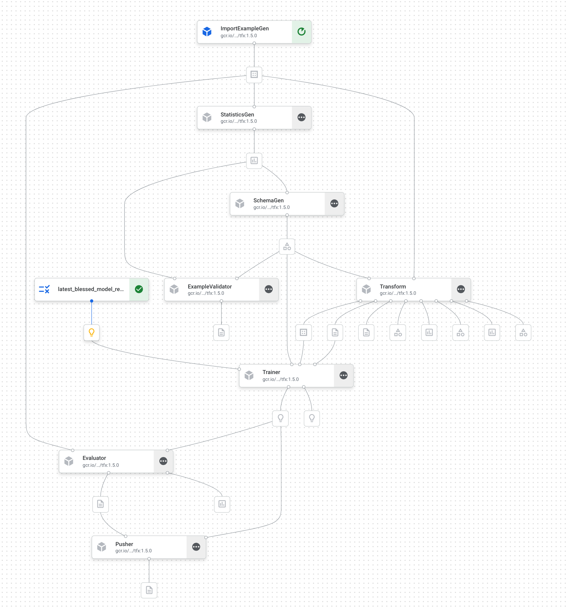

Once the pipeline is finished, go to the Vertex AI console and click on
`Endpoints`. Your model will be deployed and ready to serve predictions.

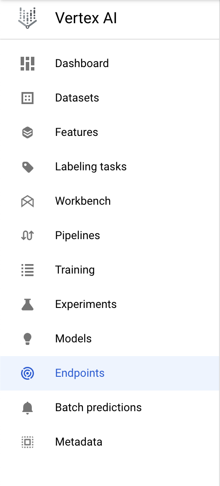

With that, you've finished the lab!

🎉 Congratulations! 🎉

You've learned how to use TFX to:

*   Build local pipelines to quickly experiment and debug your code
*   Run your pipeline on Vertex Pipelines and kick off pipeline runs with the
    SDK
*   View StatisticsGen component artifacts

## Cleanup

So that you're not charged, it is recommended that you delete the resources
created throughout this lab.

### Step 1: Stop or delete your Notebooks instance

If you’d like to continue using the notebook you created in this lab, it is
recommended that you turn it off when not in use. From the Notebooks UI in your
Cloud Console, select the notebook and then select **Stop**. If you'd like to
delete the instance entirely, select **Delete**:


### Step 2: Delete your endpoint

To delete the endpoint you deployed, navigate to the **Endpoints** section of
your Vertex AI console and click the delete icon:

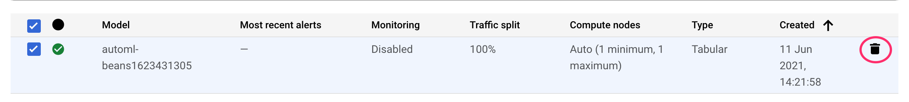

Then, click **Undeploy** from the following prompt:

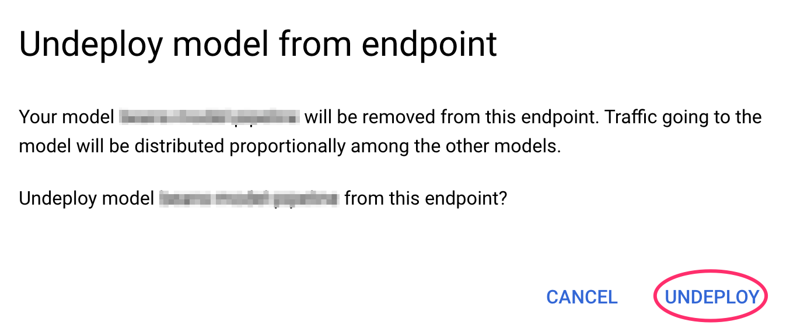

### Step 3: Delete your Cloud Storage bucket

To delete the Storage Bucket, using the Navigation menu in your Cloud Console,
browse to Storage, select your bucket, and click Delete:

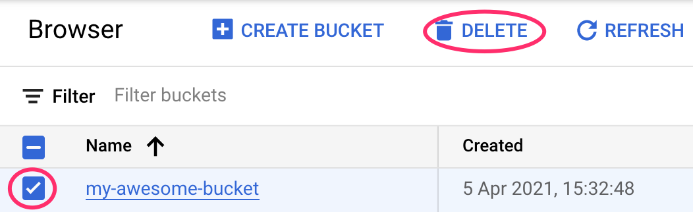

## Related materials

*   For more about Tensorflow Extended, please visit
    https://www.tensorflow.org/tfx
