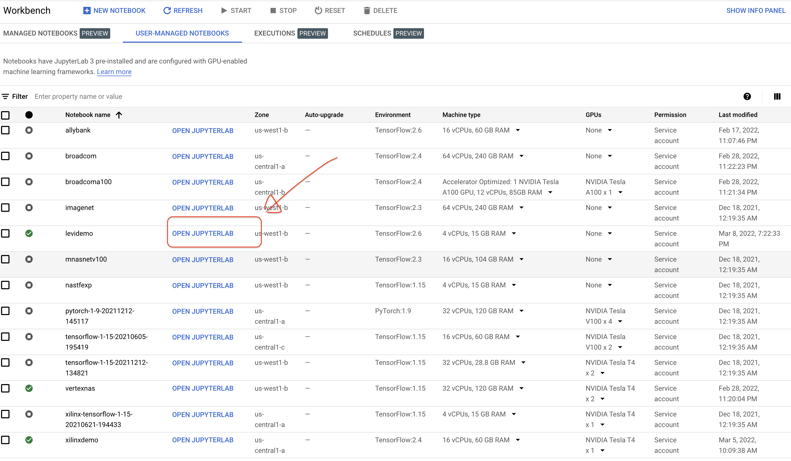
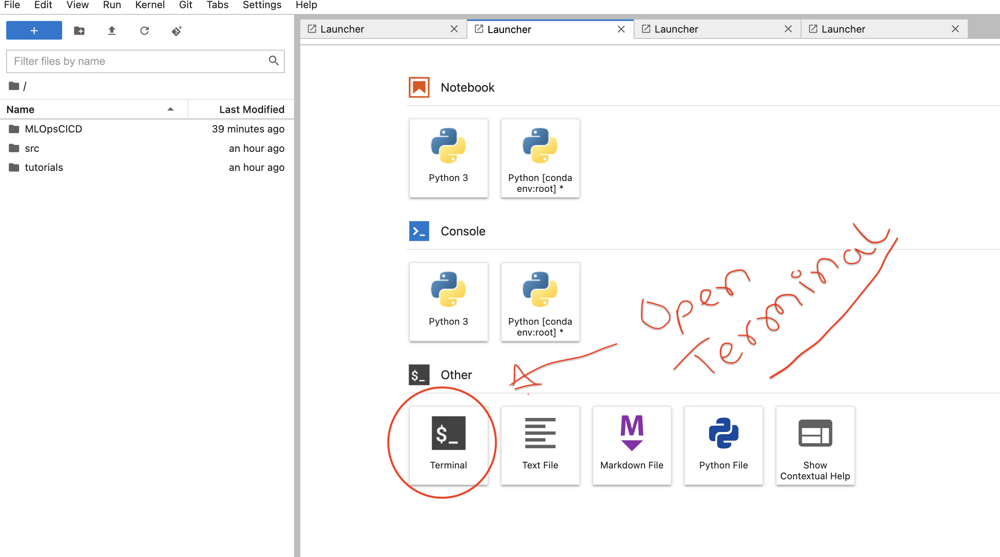

### Setup

For the lab it is assumed that you are familiar with [Vertex AI](https://cloud.google.com/vertex-ai). Vertex AI is Google Cloud's Machine Learning Development and Model Management platform. Please read the documentation for the full feature. 

These steps are for environment setup to get your code up and running.

* **Step 1: Create a User Managed Workbench**

  Follow the [steps](https://cloud.google.com/vertex-ai/docs/workbench/user-managed/create-user-managed-notebooks-instance?hl=en) in the following guide to setup the workbench
  Choose a default image. You do not need a large image as this will act as client to your code.
  
* **Step 2: Open the JupyterLab **

   

* **Step 4: Open a Terminal window in the workbench**

* **Step 5: Clone the repository**
  Create a new directory mlops
     * `mkdir mlops`
     * ` git clone  https://github.com/shivajid/MLOpsCICD.git`

