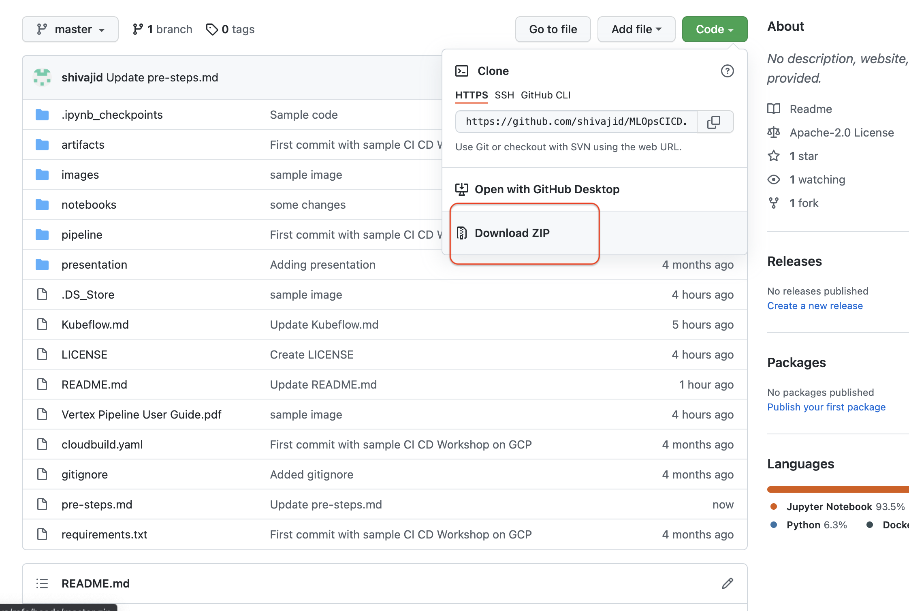

### Setup

For the lab it is assumed that you are familiar with [Vertex AI](https://cloud.google.com/vertex-ai). Vertex AI is Google Cloud's Machine Learning Development and Model Management platform. Please read the documentation for the full feature. 

These steps are for environment setup to get your code up and running.

* **Step 1: Create a User Managed Workbench**

  Follow the [steps](https://cloud.google.com/vertex-ai/docs/workbench/user-managed/create-user-managed-notebooks-instance?hl=en) in the following guide to setup the workbench
  Choose a default image. You do not need a large image as this will act as client to your code.
  
* **Step 2: Open the JupyterLab **

   

* **Step 4: Open a Terminal window in the workbench**

* **Step 5: Download the zip of the repository**
  
    **Note: If you plan to use the CI/CD and build. Do not clone the repo, but download as zip from the repository**
    
    

* **Step 6: Upload the zip to your notebook**
* **Step 7: Setup the Source repository**
    * Navigate to the terminal window in Step 4 and execute following commands
      * `pip3 install --upgrade google-cloud-aiplatform`
    * Set the following environment variables
      * `PROJECT_ID = "[YOUR PROJECT]"  # @param {type:"string"}`
      * `INITIALS = "[YOUR INITIALS]"`
      * `REPO_NAME = "[YOUR REPO NAME]" #@param {type:"string"}`
      * `WORKING_DIR="[YOUR WORKING DIR]`
      * `gcloud source repos create $REPO_NAME`
    * Browse the Google Cloud Source Repo to check the repo is created. Alternatively you can call
      * `gcloud source repos list`
      * `mkdir $WORKING_DIR`
      * `cd $WORKING_DIR`
      * `gcloud source repos clone $REPO_NAME`
    *  Set the Git config informatio
      * `git config --global user.email "you@example.com"`
      * `git config --global user.name "Your Name"`
    
*  **Step 8: Unzip the MLOpsCICD-master.zip file**
  *   `cd ` 
  *   `mkdir tmp`
  *  `unzip MLOpsCICD-master.zip -d ~/tmp`
*  **Step9: Copy the content of the ~/tmp/MLOpsCICD-master**
  *  `cp -r ~/tmp/MLOpsCICD-master  $WORKING_DIR/$REPO_NAME/`
 
* **Step 10: Add the code to the Google Cloud Source Repo**
  *  `cd $WORKING_DIR/$REPO_NAME/`
  *  `git add .` # Do not forget the dot.
  *  `git commit -m "Your message" `
  *  `git push`
  *  Check in the cloud source repo if the code has been checked in

[Return](README.md)

